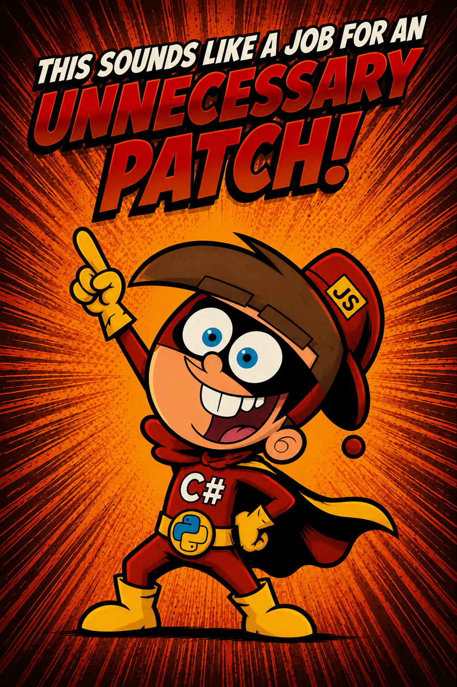

<p align="center">  </p>


# AAGM-C: Automated Assistant Game Master - Claude

*Foundry ↔ Claude bridge. Formerly plain "AAGM". The -C marks the Claude member of the family, with an OpenAI sibling (AAGM-O) in development.*

**Jump to:** [Installation](#installation) · [Setup](#a-setup-one-time) · [Using it](#b-using-it-once-deployed) · [Troubleshooting](#troubleshooting-quick-hits) · [The Plug-in API](#the-plug-in-api) · [License](#license)

**Plug-ins:** [Item Forge](#claude-item-forge-plug-in-macro) · [Foe Forge](#claude-foe-forge-plug-in-macro) · [Link ReForge](#claude-link-reforge-plug-in-macro) · [Total Actor Backup](#claude-total-actor-backup-plug-in-macro)

**Module source can be found:** [`module/scripts/`](module/scripts)

**Relay source can be found:** [`relay/src/`](relay/src)

A localhost bridge between a Forge-hosted **Foundry VTT v12** world (Tested on Pathfinder 1e, should work on other systems as of 7/18/26) and **Claude** (Code or Chat). Two pieces:

- **`relay/`** - a Node process on your machine. Runs the WebSocket server (talks to the Foundry module) and the MCP server (talks to Claude) in one process. Localhost-only.
- **`module/`** - the `foundry-bridge` module (v0.7.0) running in the GM's browser tab. Opens a WebSocket out to the relay.

Claude reaches Foundry **only** through the relay, and every write passes a confirmation gate.

**WARNING:** If you fork this, be ready for some entertaining choices in engineering required to avoid Anthropic's API!

---

## Installation

The bridge has two installable halves - the **Foundry module** and the **relay**.

**1. Foundry module** - in Foundry / Forge → *Install Module → Manifest URL*, paste:
```
https://github.com/DatJavaClass/AutomatedAssistantGM/releases/latest/download/module.json
```
This resolves once a GitHub release with `module.json` + `module.zip` attached is published. You'll enable the module later (see Setup → running a session).

**2. Relay + source** - clone the repo (or use your existing working copy):
```
git clone https://github.com/DatJavaClass/AutomatedAssistantGM.git
```
The relay lives in `relay/`; the module files sit at the repo root (standard Foundry-module layout).

Then continue to **Setup**.

---

## A) Setup (one-time)

### 1. Relay dependencies
Needs **Node ≥ 22**. From the cloned repo root:
```
cd relay
npm install
```

### 2. Set the GM userId
`relay/config.json` maps Foundry **userIds** to capability sets. Add your GM's id: in Foundry, open the console (F12) → run `game.user.id`, and paste the bare string as a key under `"users"` (give it `"capabilitySet": "debug"`). The `userName` beside it is a human-readable comment only - the relay matches on the id, not the name.

### 3. Register the MCP endpoint with Claude Code
```
claude mcp add foundry-bridge --transport http http://127.0.0.1:7879/mcp
```
Add `--scope user` if you want the tools available from any directory.

> **Restart rule.** Claude Code loads MCP tools at startup and caches the tool list. After `claude mcp add` - or after the relay gains any new `foundry_*` tool - **fully quit and relaunch Claude Code**, then restart your loop. A new in-app session is not enough.

---

## B) Using it once deployed

**The primary workflow is the chat box + an external loop, and it works end-to-end.** With the relay up and a Claude Code `/loop` polling, you operate the whole world conversationally from the "Open Claude Code Chat" macro - Claude handles real GM work: fixing corrupted actors, moving tokens, running combat for them - with each write clearing the Approve/Deny gate. The raw MCP tools listed below are the surface that loop is built on.

### Start a session
1. **Start the relay** from the repo root (leave it running):
   ```
   cd relay
   npm start
   ```
   Wait for `[relay] ready - WS on ws://127.0.0.1:7878, MCP on http://127.0.0.1:7879/mcp`.
2. **Enable the bridge in exactly ONE GM window.** Foundry → *Configure Settings → Module Settings → enable the bridge*. You should see "Foundry-Claude bridge connected" and a `bridge.connected` line in the relay's stdout.
   > A second Foundry tab on the same GM userId is rejected (WS close `4002`). Keep the bridge on in only one window.
3. **In Claude Code**, `/mcp` should show `foundry-bridge` connected. Sanity-check with `foundry_ping` → expect `{ pong: true, worldId: "<your-world>", ... }`.

### What Claude can do (MCP tools)
- **Read:** `foundry_ping`, `foundry_query_actor`, `foundry_query_scene`, `foundry_query_macro`, `foundry_query_journal`, `foundry_query_user`, `foundry_tail_logs`.
- **Eval:** `foundry_eval` runs JS in the GM client. Reads run freely; mutating/destructive code is reclassified at the relay and routed through the confirmation gate. DB-backing journals are hard-refused.
- **Damage:** `foundry_apply_damage` previews before→after on live HP and picks the gate tier from the outcome: everyone stays at 1+ HP is a single confirm, anything landing below 1 HP escalates to a **double** confirm. Healing or setting HP directly is an ordinary gated `foundry_eval` write.
- **Chat channel:** `foundry_get_prompts` / `foundry_send_reply`.
- **Loot rescue:** `foundry_loot_pending` / `foundry_restore_loot` (see the Claude Loot Watchdog below).
- **Chain Mode:** `foundry_chain_offer` - one approval covering a declared batch of same-shaped writes (Co-GM/Custom modes only; see the Change Log).

### Two GUI surfaces (auto-created macros in Foundry)
Both appear in your macro directory once the bridge connects:
- **"Open Claude Code Chat"** - the in-Foundry chat box. To use it: in Claude Code run a tight loop that calls `foundry_get_prompts` (it long-polls ≤25s) and answers with `foundry_send_reply`, e.g. `/loop 2s` instructed to call `foundry_get_prompts` back-to-back. Open the macro: it shows "Ready to chat" once the loop polls; type → Claude answers in the box. Write requests render an **Approve/Deny** card (deletes need a **double** confirm).
- **"Claude Loot Watchdog"** - run it to ARM; it records any loot that vanishes mid-transfer from an Item Pile, and the loop auto-restores exactly what was recorded (recorded item, recorded quantity, recorded recipient, nothing else). Run it again to disarm.

### Pick your mode
*Configure Settings → AAGM-C Settings* (GM only). **Assistant Mode** is the default: every change individually confirmed. **Co-GM Mode** trusts you with multitasking and Chain Mode offers. **Custom** unlocks the individual switches, including the local **Macro Mirror** (that one is available in every mode).

### Stop
- End the chat loop: type `/exit` in the box, or `touch relay/.loop-stop`.
- Stop the relay: `Ctrl+C`.

### Safety gates (do not bypass)
Confirmation gate on all writes · double-confirm on deletes and lethal outcomes · Chain Mode never covers destructive work · DB-journal access refused · one chat-box listener at a time · relay binds localhost only. These are load-bearing - never weaken them.

---

## Troubleshooting (quick hits)
| Symptom | Fix |
|---|---|
| `/mcp` shows foundry-bridge failed | Relay not running on `127.0.0.1:7879`. Start it; check stdout. |
| `foundry_ping` → "no bridge connected" | Module didn't reconnect after a relay restart. Toggle the bridge setting off/on; watch for a new `bridge.connected` line. |
| New `foundry_*` tool missing | Fully quit and relaunch Claude Code (tool list is cached). |
| `hello.reject "unknown userId"` | `game.user.id` doesn't match `relay/config.json`. |
| `hello.reject "duplicate userId"` | Two Foundry tabs as the same GM. Close one. |

---

> ⚠️ **Known operator hazard: Claude's Fireball obsession.** The assistant driving this bridge has been observed reaching for *Fireball* as the answer to essentially any problem - including corrupted actors (immune: they're JSON), incorporeal threats, and the occasional merge conflict. If a fix proposal includes "and then a 8d6 evocation," deny the gate and gently suggest a saving throw. The spell list is wider than it looks.

---

## The Plug-in API

The bridge is extensible, and the four plug-ins below are the proof: each one is just a world macro serving as an endpoint behind the gated eval - scope object in, `{ ok }` / `{ ok:false, error }` out, bare run as a diagnostic. The alpha contract is written up in [`Docs/PLUGIN_API_ALPHA.md`](Docs/PLUGIN_API_ALPHA.md); build your own and it rides the same Approve/Deny gate as everything else.

---

<p align="center">  </p>

# Change Log

What changed and when. Newest first, no archaeology required.

**0.8.0 - The AAGM-C Update (2026-08-13)**
- AAGM is now **AAGM-C: Automated Assistant Game Master - Claude**. Same bridge, clearer name, and an OpenAI sibling (AAGM-O) is in development.
- A real settings menu at *Configure Settings → AAGM-C Settings*. Three presets: Assistant confirms everything, Co-GM trusts you, Custom hands you the switches.
- **Chain Mode.** Ten same-shaped writes no longer cost ten Approve clicks, one approval covers the declared batch. Anything destructive kills the chain on the spot.
- **Macro Mirror.** "Claude, back up all the macros" now means exactly that. Old versions rotate to `.bkp`, the mirror never deletes.
- **Single-listener lock.** One Claude loop per chat box now, a second gets refused with a toast. Two loops once split one conversation down the middle and I spent an afternoon diagnosing my "amnesiac" assistant, never again.
- Contextual sorting (Experimental) files backups into the local folders that mostly match your Foundry folders, checkmarks and all. "Apple" will never match "Banana", and that is why the box says Experimental.

**0.7.0 (2026-08-09)**
- The Macro Workshop is retired. Good idea, wrong medium, and macro pushes ride the gated eval now.
- The absolute ≥1 HP floor is gone. HP writes are ordinary gated writes, and any outcome below 1 HP escalates to a double confirm.

**0.6.0 (2026-07-14)**
- **Claude Loot Watchdog.** When an Item Pile transfer eats loot, the watchdog records it and Claude restores exactly what vanished. Nothing more, nothing less.
- One-click startup: `AAGM.cmd` brings up the relay, the loop, and your session.
- `GET /healthz` on the relay, so launcher scripts can ask before they leap.

---

# Claude Item Forge (plug-in macro)

A paste-in world macro that turns the bridge into a magic-item factory. Describe an item to Claude in the chat box ("a +1 keen longsword", "boots that let the wearer walk on smoke") and Claude builds the complete item data for your game system, then invokes this macro through the gated eval. The finished item lands in a dedicated compendium, filed in the right folder, with the Approve/Deny card as the safety boundary. Good for conjuring a magic item in a pinch, mid-session, without leaving the table.

Source: [`plugins/ClaudeItemForge.js`](plugins/ClaudeItemForge.js)

### Install
1. In Foundry, create a new **Script** macro named exactly `Claude Item Forge`.
2. Paste the contents of `plugins/ClaudeItemForge.js` into it and save.
3. Click the macro once. The bare run creates the storage below, repairs it if folders went missing, and shows a routing diagnostic. Bare runs never write items.

### Storage it creates (automatically, on first run)
```
Claude Items  (world Item compendium)
├─ Claude Magic Weapons
│  ├─ Claude Magic Simple Weapons    <- weapon-simple
│  ├─ Claude Magic Martial Weapons   <- weapon-martial
│  ├─ Claude Magic Exotic Weapons    <- weapon-exotic
│  ├─ Claude Magic Firearms          <- weapon-firearm
│  └─ Claude Magic Ammo              <- ammo
├─ Claude Magic Armor                <- magic-armor
├─ Claude Wondrous Items             <- wondrous
└─ Claude Alchemy                    <- alchemy
```
The arrows are the `destination` keys Claude passes when forging.

### How Claude invokes it
One gated eval per item, with declared intent `"write"`:
```js
return await game.macros.getName("Claude Item Forge").execute({
  destination: "weapon-martial",
  itemData: { name: "...", type: "weapon", img: "icons/...", system: { ... } }
});
```
Returns `{ ok, uuid, name, folder, pack, warnings }` on success, `{ ok:false, error, ... }` on refusal.

### Guard rails
- **Duplicate refusal.** A same-name item in the pack refuses the forge unless `allowDuplicate: true` is passed, so a retried request can never double-create.
- **Portable images only.** `img` must start with `icons/` (Foundry's core icon library) or `systems/<your system id>/`, and descriptions may not embed `` tags. Nothing in the pack can dangle on world-local uploads, so the compendium stays shareable.
- **Read-back verify.** The macro re-reads the created item from the pack before reporting success. Claude should still confirm with a separate read after the gate approves; a gated eval's own return value is never proof that a write landed.
- **One item per approval.** Forge items one gated eval at a time; long batch loops inside a single eval will hit the relay timeout.

Tested on Pathfinder 1e. The macro itself is system-agnostic: it validates against your world's own item types and leaves system-correct item data to Claude.

---

# Claude Foe Forge (plug-in macro)

The Item Forge's combat-ready sibling: a paste-in world macro that turns the bridge into a monster factory. Describe a foe to Claude in the chat box ("an orc werewolf that fights with a chain", "something slow and dreadful for a swamp") and Claude clones the nearest real creature from your bestiary compendiums - or designs one from parts when nothing matches - then files the finished actor through the gated eval, sheet and hostile-ready prototype token included. The Approve/Deny card stays the safety boundary.

Source: [`plugins/ClaudeFoeForge.js`](plugins/ClaudeFoeForge.js)

### Install
1. In Foundry, create a new **Script** macro named exactly `Claude Foe Forge`.
2. Paste the contents of `plugins/ClaudeFoeForge.js` into it and save.
3. Click the macro once. The bare run seeds the config journal below and shows a source/routing diagnostic. Bare runs never write actors.

### Config journal it creates (automatically, on first run)
A journal named **"Claude Foe Forge Config"** holds the destination and every compendium Claude may pull from (bestiaries, universal monster rules, monster abilities, templates, racial HD, feats, races). Edit it like any journal text page:
```
Destination:
Insert Destination Compendium here     <- replace with a compendium id, or
                                          "world.actors" for the Actors sidebar

User Extra Content:
system.content.stuff //Example Label   <- format guide (always ignored); add
                                          your own "pack.id //Label" lines under it
```
The shipped source list is Pathfinder 1e (`pf1-bestiary` + `pf-content`); swap the pack ids for your system's content and the macro follows the journal, not the code.

### How Claude invokes it
One gated eval per foe, with declared intent `"write"`:
```js
return await game.macros.getName("Claude Foe Forge").execute({
  actorData: { name: "...", type: "npc", img: "...", system: { ... },
               items: [ ... ], prototypeToken: { ... } }
});
```
Returns `{ ok, uuid, name, destination, folder, items, warnings }` on success, `{ ok:false, error, ... }` on refusal. `{ action: "config" }` returns the parsed source list, so Claude always knows what it may search.

### Guard rails
- **Duplicate refusal.** A same-name actor at the destination refuses the forge unless `allowDuplicate: true` is passed, so a retried request can never double-create.
- **Mandatory icon coverage.** A payload with a missing/default portrait or icon-less items is refused before anything is created - no art-less monsters to repair by hand (`allowIconless: true` is the deliberate override).
- **Hostile token defaults.** Disposition, name/bar visibility, and an HP bar are filled wherever the payload left gaps; anything Claude (or a bestiary clone) supplies wins.
- **Read-back verify.** The macro re-reads the created actor before reporting success. Claude should still confirm with a separate read after the gate approves; a gated eval's own return value is never proof that a write landed.
- **One foe per approval.** Forge foes one gated eval at a time; long batch loops inside a single eval will hit the relay timeout.

Tested on Pathfinder 1e (straight clones, template applications, and vague open-ended briefs). The macro itself is system-agnostic: it validates against your world's own actor types and follows whatever source list your config journal carries.

---

# Claude Link ReForge (plug-in macro)

The repair bay of the plug-in family: a paste-in world macro that fixes broken compendium links after a world migration, server transfer, or re-import. Tell Claude "repair the linkages" and it scans your packs for dead UUID references, works out which live compendium each dead pack became, proves the mapping with a dry run you approve, and only then rewrites the links. Built on the proven name-match core of two battle-tested repair macros, generalized to find links anywhere in a document - class associations, racial traits, description text, journal pages.

Source: [`plugins/ClaudeLinkReForge.js`](plugins/ClaudeLinkReForge.js)

### Install
1. In Foundry, create a new **Script** macro named exactly `Claude Link ReForge`.
2. Paste the contents of `plugins/ClaudeLinkReForge.js` into it and save.
3. Click the macro once. The bare run shows a diagnostic (version, scan scope, receipt state). Bare runs never write.

### The three-op flow
```
scan    -> every broken reference, grouped by dead pack id    (read-only)
dryrun  -> resolves them against a proposed mapping, reports
           per-pair match rates, stores a receipt             (approving = approving the MAPPING)
apply   -> executes exactly the receipted dry run             (approving = approving the WRITES)
```
Resolution is by preserved `_id` first, then by name (exact, then cleaned of suffixes like "(Ex)" or "at 5th level"). A low match rate means a wrong pack - the report says so, and apply should not follow.

### How Claude invokes it
One op per gated eval:
```js
return await game.macros.getName("Claude Link ReForge").execute({ action: "scan" });
return await game.macros.getName("Claude Link ReForge").execute({
  action: "dryrun", mapping: { "world.dead-pack": "world.live-pack" } });
return await game.macros.getName("Claude Link ReForge").execute({
  action: "apply",  mapping: { ... }, confirmHash: "lr-..." });
```
Each op returns `{ ok, ... }` with its report, or `{ ok:false, error }` on refusal. Scan defaults to world compendiums; pass `packs: [...]` to include module-hosted ones.

### Guard rails
- **No dry run, no apply. Ever.** `apply` refuses unless its job hashes to the `confirmHash` of a dry-run receipt less than 30 minutes old. Change the mapping, the scan scope, or the skip rule and the hash breaks.
- **Keep and report, never guess.** Unresolved links, malformed entries, and Bonus Feat associations are left untouched and listed for manual repair.
- **Leaf-only rewrite.** Only the UUID string itself changes; names, levels, and any custom fields on a link survive untouched. Provenance metadata (`_stats`, `flags`) is never walked.
- **Time-boxed and re-runnable.** Long repairs stop safely inside the gate's window; a re-run picks up where it left off, and already-fixed links drop out on their own.
- **Verify after.** Claude confirms with a fresh scan after the gate approves; a gated eval's own return value is never proof that a write landed.

Tested on Pathfinder 1e (an 89-link class/features relink after a full compendium migration). The macro itself is system-agnostic: it repairs whatever UUID references your documents actually carry, regardless of system schema.

> **A quirk worth knowing.** Because Link ReForge walks whole documents rather than a single link field, it will sometimes find and repair flaws you didn't know a compendium had - stale references left behind by older migrations or hand edits, not just the breakage you pointed it at. It never does so uninvited: every repair shows up in the dry-run report first, and nothing is written without the gate's permission.

---

# Claude Total Actor Backup (plug-in macro)

Character insurance for the whole table: a paste-in world macro that snapshots entire actors into self-contained "Backup Seed" items and rebuilds them later. Say "Claude, back up all PCs and NPC Bob" at the start of a session and every one of them gets a seed - stats, race, class levels, features, gear, images, biography. When a sheet gets corrupted, a migration goes sideways, or a player experiments a little too hard, the character comes back from the seed. Ported from a battle-tested backup macro and its embedded restore script, restore order and timing quirks intact.

Source: [`plugins/ClaudeTotalActorBackup.js`](plugins/ClaudeTotalActorBackup.js)

### Install
1. In Foundry, create a new **Script** macro named exactly `Claude Total Actor Backup`.
2. Paste the contents of `plugins/ClaudeTotalActorBackup.js` into it and save.
3. Click the macro once. The bare run creates the storage folder below and shows a diagnostic. Bare runs never write seeds.

### Storage it creates (automatically, on first run)
A **"Claude Actor Backups"** folder in the Items tab. Seeds are ordinary world items with timestamped names, so generations accumulate and the GM can inspect, rename, or hand one out without unlocking anything. `prune` keeps the newest N per actor and only ever touches this folder - seeds you park elsewhere are never deleted by the plug-in.

### How Claude invokes it
One op per gated eval:
```js
return await game.macros.getName("Claude Total Actor Backup").execute({
  action: "backup", actors: ["Syb", "Danger Dan"] });
...execute({ action: "list", actor: "Syb" });
...execute({ action: "restore", seed: "<uuid or seed name>", target: "<actor>" });
...execute({ action: "prune", actor: "Syb", keep: 5 });
```
Each op returns `{ ok, ... }` with its report, or `{ ok:false, error }` on refusal.

### Manual mode - seeds work without Claude
Every seed carries its own on-use **Restore Actor** script. Drop a copy into an actor's inventory and use it: a confirmation dialog spells out the wipe, then the actor is rebuilt as the snapshotted character and the used copy consumes itself. The GM **or the actor's owner** may trigger it, so a busy GM can toss a seed to a player and keep running the game. The folder originals are the archive: Claude's `restore` op never consumes a seed, while handed-out copies are one-shot.

### Guard rails
- **Type match is absolute.** A seed only restores onto an actor of its own type. There is no override flag, on either path.
- **Blank targets only.** `restore` refuses a target that has any items unless `allowNonEmpty:true` is passed, which wipes it first and is declared destructive (double confirm). The manual path's confirmation dialog is the same consent, human-shaped.
- **Definition, not state.** Current HP, damage, conditions, and active effects are not captured - a seed is the character, not the moment. Restored characters come back at full HP.
- **Spells are excluded** (they restore as feats - a PF1e known issue). The backup report counts what was left out.
- **Backup never deletes anything.** Only the explicit `prune` op removes old seeds.
- **Verify after.** Claude confirms with a separate read after the gate approves; a gated eval's own return value is never proof that a write landed.

Fair warning: more than any other part of AAGM, this plug-in is built **exclusively for Pathfinder 1e**. The restore sequence leans on PF1e's class/race child generation (add the parents, wait for the system to settle, strip its auto-generated defaults, then restore the character's real features), the spell exclusion is a PF1e workaround, and the manual mode rides PF1e item script calls. On other systems, expect nothing.

---

Want to build your own plug-in? All four plug-ins follow one contract - a world macro as the endpoint behind the gated eval. The bare essentials are in [`Docs/PLUGIN_API_ALPHA.md`](Docs/PLUGIN_API_ALPHA.md).

---

## License

MIT - see [`LICENSE`](LICENSE). Fork it, build on it, ship it; keep the copyright notice so the original stays credited.

Not affiliated with, endorsed by, or sponsored by Paizo Inc., Foundry Gaming LLC, or The Forge. Pathfinder is a trademark of Paizo Inc.; Foundry VTT and The Forge are trademarks of their respective owners. This repository ships no Paizo content - the PF1e integration talks to the community pf1 game system's API and your own world's data.

