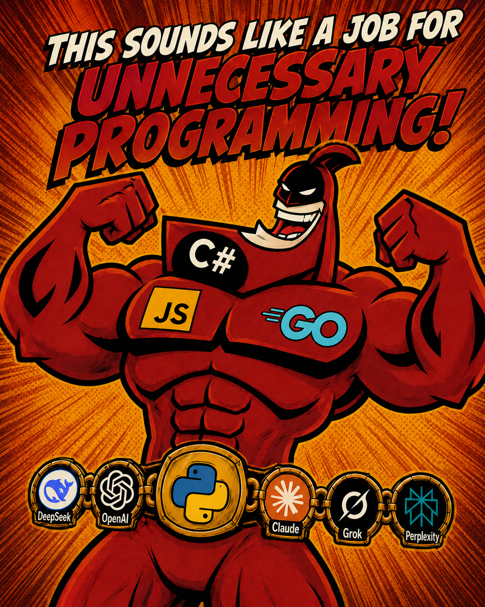

DatJavaClass here, I am terrible at writing readme files, great at talking people through things, bad a putting pen to paper or finger to keyboard on how to. So yes, I did have an LLM write this readme. So it could be coherent. So it could be understood. So you could just maybe get an idea of what I build here. IF the fact that a readme is coherent offends you? I am sorry. If not, I hope what I made is useful and I genuinely hope it helps you have fun in your game. Roll on my friends, Roll on.

There are a lot of mixed feelings about the use of LLMs, AI, in the TTRPGs. Many are negative. But before you kneejerk and hit your knee on your desk leg I do ask you at least entertain me as I'm very bored. I'd like you to look up a group on Patreon called [Borough Bound](https://www.patreon.com/boroughbound), they make amazing maps, some of the best. You can run an entire campaign in one of their maps. In fact that's the intent. Their maps are huge. We're talking 14,000 by 12,000 pixels in some cases. My Pathfinder 1e game? I use six of these. SIX. Do the math on that. Now that you have? It's an Open world game using [Stairways](https://foundryvtt.com/packages/stairways) that lets players go into these amazing cities, and go into a minimum of 37 buildings at will. Add that up! Now let's not even count the randomization macro that shuffles the 20 rationally sized battle maps between the cities and dynamically salts monsters. All without the AI. It's enough to drive a man insane! And I put my tuna fish on one foot at a time like any lobster! Which is why I created the AAGM module. It's not something to do our job as creators, as story tellers, as moment makers. It's something to say "Hey, that fatass over there, put a vorpal dagger on him." or "Make sure there are five horses in the next scene with saddles ready to go" or "The party's had it rough, lower the CR of the next few rooms by 2." The AAGM is just that. an "Assistant" GM. It does the grunt work so you can run the epic game you always wanted. Now go forth, put on your tuna one foot at a time and tell your stories my fellow GMs!

  

# Automated Assistant Game Master (AAGM)

One bridge, four assistants. AAGM connects a **Foundry VTT v12** world to an LLM through a localhost relay: a Foundry module talks to a Node relay on your machine, the relay exposes MCP tools to the model, and the model does real GM work from a chat box inside Foundry. Tested on Pathfinder 1e on The Forge, should work on other systems.

It started as one project for Claude. Then I wanted the same thing for Codex, then Grok, then Kimi, and a branch per model stopped scaling. So this is the family home now. Each member lives in its own folder, with its own module, relay, docs, manifest, and a listener prompt written for its model. They are clones, not carbon copies: the Foundry side is held to one shared bar, the model side is free to differ.

## The family

| Member | Model | Folder | Version | Manifest URL (Foundry: Install Module, paste it) |
|---|---|---|---|---|
| **AAGM-C** | Claude (Claude Code) | [`AAGM-C/`](AAGM-C) | 2.0.0 | `https://raw.githubusercontent.com/DatJavaClass/AutomatedAssistantGM/grape/AAGM-C/module/module.json` |
| **AAGM-O** | Codex (OpenAI) | [`AAGM-O/`](AAGM-O) | 2.0.0 | `https://raw.githubusercontent.com/DatJavaClass/AutomatedAssistantGM/grape/AAGM-O/module/module.json` |
| **AAGM-G** | Grok (Grok Build) | [`AAGM-G/`](AAGM-G) | 2.0.0 | `https://raw.githubusercontent.com/DatJavaClass/AutomatedAssistantGM/grape/AAGM-G/module/module.json` |
| **AAGM-K** | Kimi (Kimi Code) | [`AAGM-K/`](AAGM-K) | 2.0.0 | `https://raw.githubusercontent.com/DatJavaClass/AutomatedAssistantGM/grape/AAGM-K/module/module.json` |

Each folder's README carries the full install, setup, tool list, and troubleshooting for that member. Install one member per world. They share module ids with nobody, but they do share your GM account, and one GM window can hold one bridge at a time.

## What 2.0 is

All four moved to 2.0 on the same day, for the same four reasons. First, interrupts: type while the assistant is mid task and the message reaches it before the task ends. Second, Rollback Points in place of Approve/Deny gates: every write snapshots what it touches first, and a Roll back button in the box puts the world back. Third, `/ext` and `/int`: tell the box you have moved to a terminal session and it parks itself. Fourth, a log. One markdown file per day, one line per thing done.

One capture design under that description, in all four: a point holds only the documents the write touched, captured through Foundry hooks the moment they change, so a point is kilobytes, not a world dump, and a rollback never deletes what it did not create. The three Codex based members also keep a redo point when they roll back. Read the folder README before you pick.

## What every member shares

- **The Plug-in API.** A plug-in is a world macro that describes itself: run it bare and it returns a manifest (name, version, argument schema, what it writes); call it through `foundry_plugin` and the relay validates the call against that manifest and holds the write to the declared scope. The 1.0 contract is [`PLUGIN_API.md`](PLUGIN_API.md); the four shipped plug-ins are in [`AAGM-C/plugins/`](AAGM-C/plugins). They do not care which member calls them.
- **The safety net.** Database journals used as macro backing stores are never read, written, or snapshotted. A rollback never writes a linked token's delta through to its actor. The relay binds to localhost only. One listener per chat box. These hold in every folder or the folder is not done.
- **The bar.** The rule for the family is simple: same Foundry facing behavior, own model facing behavior, never a carbon copy.

## License

MIT, see [`LICENSE`](LICENSE). Fork it, build on it, ship it; keep the copyright notice so the original stays credited.

Not affiliated with, endorsed by, or sponsored by Paizo Inc., Foundry Gaming LLC, The Forge, Anthropic, OpenAI, xAI, or Moonshot AI. Pathfinder is a trademark of Paizo Inc.; Foundry VTT and The Forge are trademarks of their respective owners. This repository ships no Paizo content.
